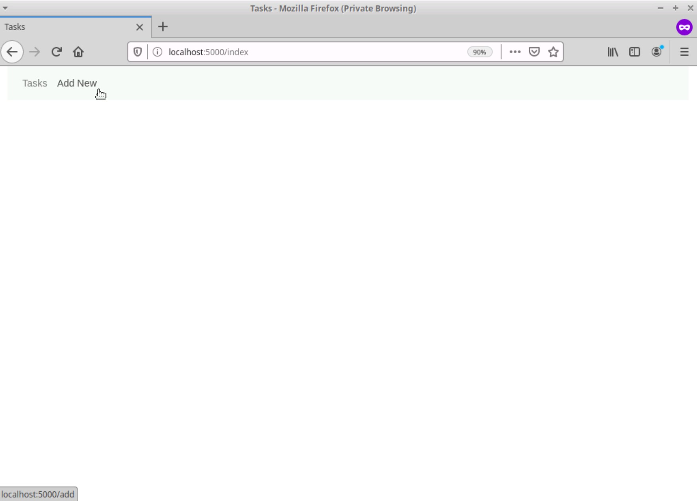
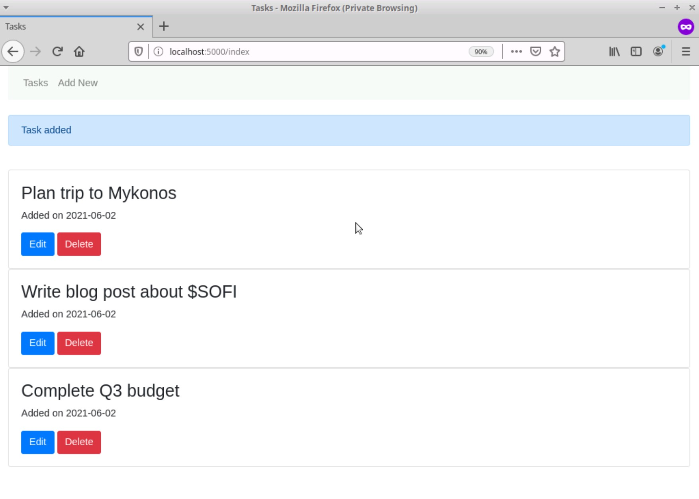
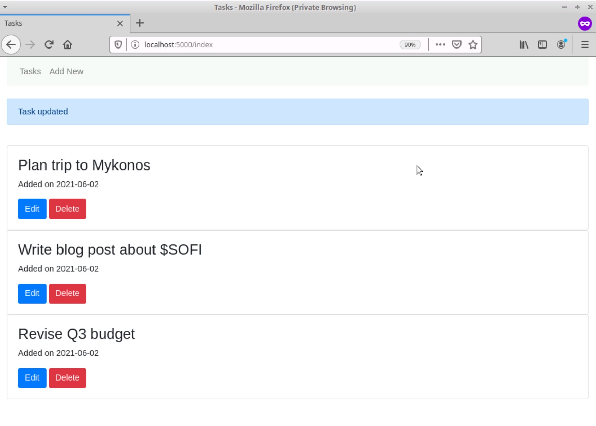
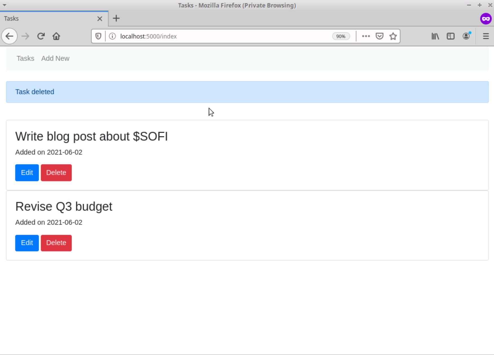

# Flask To-Do App

A modern, lightweight task management web application built with Flask. This application provides a clean interface for managing your daily tasks with core features including creation, modification, and removal of tasks.

## 🚀 Features

- Create new tasks with titles
- Edit existing tasks
- Delete tasks when completed
- Automatic timestamp tracking for tasks
- Clean and responsive user interface
- SQLite database for data persistence
- Form validation and flash messages for user feedback

## 🛠️ Technology Stack

- **Backend**: Flask (Python web framework)
- **Database**: SQLAlchemy with SQLite
- **Forms**: WTForms for form handling and validation
- **Frontend**: HTML templates with modern styling

## 📋 Prerequisites

- Python 3.6 or higher
- pip (Python package manager)

## 🔧 Installation

1. Clone the repository
```bash
git clone https://github.com/yourusername/flask-todo-app.git
cd flask-todo-app
```

2. Create a virtual environment (recommended)
```bash
python -m venv venv
source venv/bin/activate  # On Windows use: venv\Scripts\activate
```

3. Install dependencies
```bash
pip install flask flask-sqlalchemy flask-wtf
```

4. Initialize the database
```python
python
>>> from app import db
>>> db.create_all()
>>> exit()
```

5. Run the application
```bash
python app.py
```

The application will be available at `http://localhost:5000`

## 📱 Usage

### Adding a Task
1. Click the "Add Task" button
2. Enter the task title
3. Submit to create the task

### Editing a Task
1. Click the "Edit" button next to the task
2. Modify the task title
3. Save your changes

### Deleting a Task
1. Click the "Delete" button next to the task
2. Confirm deletion in the prompt


## 🖼️ Screenshots

<table width="100%">
<tr>
<td width="50%"><strong>Home Page</strong></td>
<td width="50%"><strong>Add Task</strong></td>
</tr>
<tr>
<td></td>
<td></td>
</tr>
<tr>
<td><strong>Edit Task</strong></td>
<td><strong>Delete Task</strong></td>
</tr>
<tr>
<td></td>
<td></td>
</tr>
</table>


## 📁 Project Structure
```
flask-todo-app/
├── app.py              # Application initialization
├── forms.py            # Form classes using WTForms
├── models.py           # Database models
├── routes.py           # Application routes and views
├── templates/          # HTML templates
│   ├── add.html
│   ├── base.html
│   ├── delete.html
│   ├── edit.html
│   └── index.html
└── README.md
```

## 🔒 Security

- CSRF protection enabled through Flask-WTF
- SQL injection prevention through SQLAlchemy ORM
- Secure form handling and input validation

## 🤝 Contributing

1. Fork the repository
2. Create a new branch (`git checkout -b feature/improvement`)
3. Make your changes
4. Commit your changes (`git commit -am 'Add new feature'`)
5. Push to the branch (`git push origin feature/improvement`)
6. Create a Pull Request

## 📄 License

This project is licensed under the MIT License - see the [LICENSE.txt](LICENSE.txt) file for details.

## 🙏 Acknowledgments

- Flask documentation and community
- SQLAlchemy documentation
- WTForms documentation

## 📞 Contact

If you have any questions or suggestions, please open an issue in the repository.
